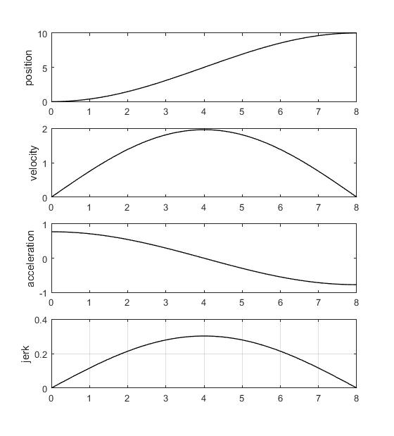

#三角函数轨迹--谐波轨迹

## Harmonic trajectory

开源项目OTPL托管在github：https://github.com/libing403/OTPL/tree/master/OTPL

谐波运动的特征是加速度曲线与位置曲线成比例，符号相反。

设点$q$为点$p$在圆的直径上的投影，如果点$p$在圆上匀速运动，那么点$q$的运动称为谐波运动。可用下式描述
$$
s(\theta)=R(1-\text{cos} \theta)
\tag{1}
$$
这里$R$为圆的半径。更一般的形式，谐波运动可以定义为
$$
q(t)=\frac{h}{2}\left (  1-\text {cos}  \frac{\pi(t-t_0)}{T}\right)+q_0
\tag{2}
$$
由此可得
$$
\begin{cases}
\dot q(t)=\frac{\pi h}{2T}\text{sin}\left ( \frac{\pi(t-t_0)}{T}\right )\\
\ddot q(t)=\frac{\pi^2 h}{2T^2}\text{cos}\left ( \frac{\pi(t-t_0)}{T}\right )\\
q^{(3)}(t)=-\frac{\pi^3 h}{2T^3}\text{sin}\left ( \frac{\pi(t-t_0)}{T}\right )\\
\end{cases}
$$

example：给定条件为$t_0=0,t_1=8,q_0=0,q_1=10$，调用谐波运动规划模块（代码及测试例子保存在[OTPL](https://github.com/libing403/OTPL/tree/master/OTPL/src/HarmonicTrajectory)项目下），得到规划结果如下图所示。

参考文献：

[1]Biagiotti L, Melchiorri C. Trajectory Planning for Automatic Machines and Robots[M]. Springer Berlin Heidelberg, 2009.